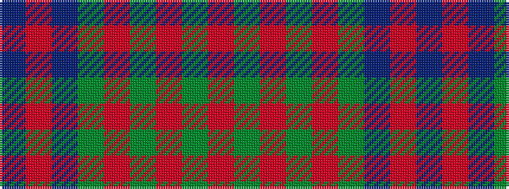

BRBGRGRGR

It is a 9 stripe tartan.

<figure class="pat-woven">

<figcaption>idealised sample</figcaption>
</figure>

## Colour Sequence



## Tartans with this colour sequence

| Tartans |
|---------------|
| [Breckon Hunting (Name)](/setts/s9/db3r1db14dg14r1dg1r1dg1r2~x4/)|
||
