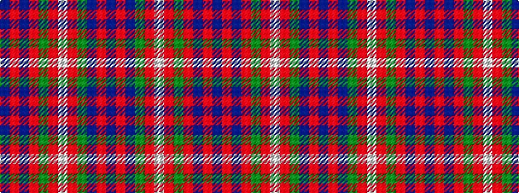

BRBGRWRGRBRB

It is a 12 stripe tartan.

<figure class="pat-woven">

<figcaption>idealised sample</figcaption>
</figure>

## Colour Sequence



## Tartans with this colour sequence

| Tartans |
|---------------|
| [Fraser of Lovat](/variants/s12/db16r1db1r1g12r16w2r16g12db12r1db1~x2/)|
||
| [Fraser of Lovat](/variants/s12/db16r2db2r2g14r13w2r13g14db14r2db2~x2/)|
||
