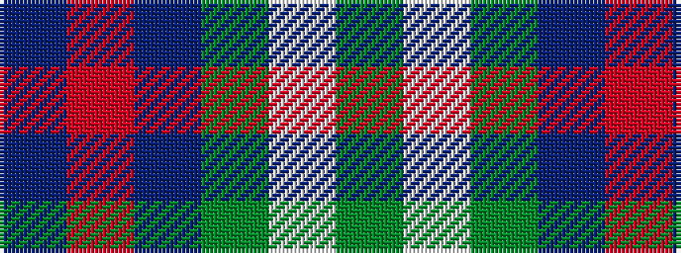

BRBGWG

It is a 6 stripe tartan.

<figure class="pat-woven">

<figcaption>idealised sample</figcaption>
</figure>

## Colour Sequence



## Tartans with this colour sequence

| Tartans |
|---------------|
| [Heritage Tartan, The](/variants/s6/db8r4db24g35lb4g8/)|
||
