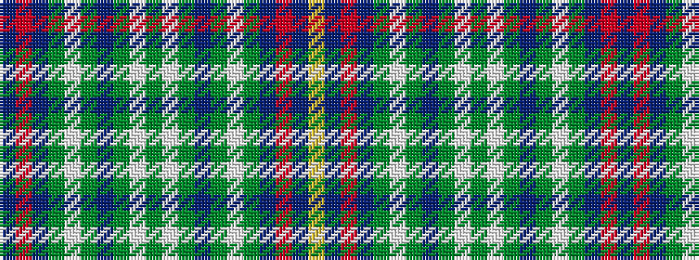

BRBGWGBGWGWGBGWGBRBY

It is a 20 stripe tartan.

<figure class="pat-woven">

<figcaption>idealised sample</figcaption>
</figure>

## Colour Sequence



## Tartans with this colour sequence

| Tartans |
|---------------|
| [United Services Planning Association](/setts/s20/db20r2db12g6lb2g4b4g4lb2g16lb2g4b4g4lb2g6db12r2db20ly3~x2/)|
||
