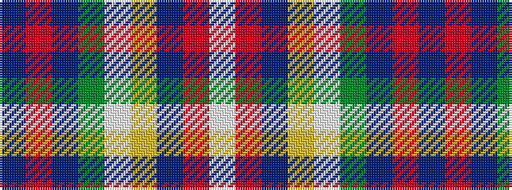

BRBGWYBRW

It is a 9 stripe tartan.

<figure class="pat-woven">

<figcaption>idealised sample</figcaption>
</figure>

## Colour Sequence



## Tartans with this colour sequence

| Tartans |
|---------------|
| [Eljamel, Sam (Personal)](/variants/s9/t38r5dt5g5w5ly5t5r5w5~x2/)|
||
