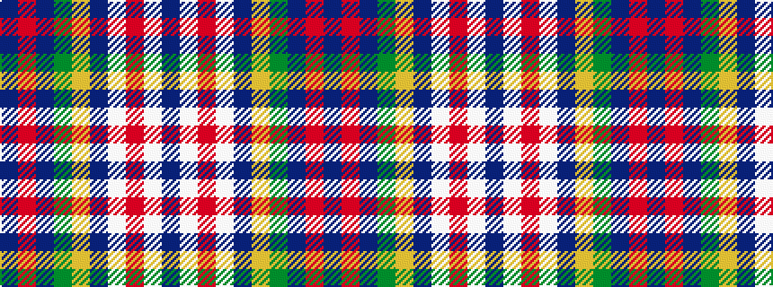

BRBGYBWRWB

It is a 10 stripe tartan.

<figure class="pat-woven">

<figcaption>idealised sample</figcaption>
</figure>

## Colour Sequence



## Tartans with this colour sequence

| Tartans |
|---------------|
| [Kansai St Andrews Society](/setts/s10/dbi30w2r3w2db14lr3dg14dbi18r2dbi3~x2/)|
||
