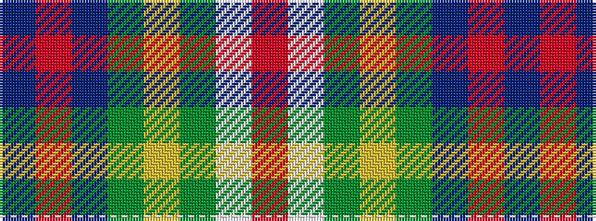

BRBGYGWR

It is a 8 stripe tartan.

<figure class="pat-woven">

<figcaption>idealised sample</figcaption>
</figure>

## Colour Sequence



## Tartans with this colour sequence

| Tartans |
|---------------|
| [Singh](/setts/s8/dp3r3dp34g18lo2g18lb2r3~x2/)|
||
| [Singh](/setts/s8/db3r3db36g17ly2g21w2r3~x2/)|
||
