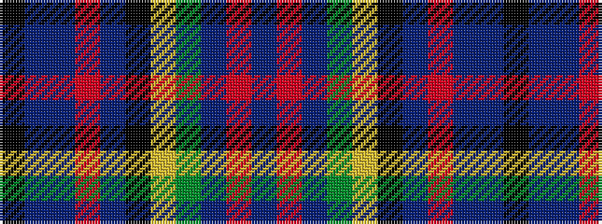

BRBGYKBRBBK

It is a 11 stripe tartan.

<figure class="pat-woven">

<figcaption>idealised sample</figcaption>
</figure>

## Colour Sequence



## Tartans with this colour sequence

| Tartans |
|---------------|
| [Stinson (Name)](/variants/s11/k7b20t2r6t2k20ly3g20b27r3b6~x2/)|
||
| [Stinson, Ancient](/variants/s11/k7db20t2r6t2k20ly3g20db27r3db6~x2/)|
||
