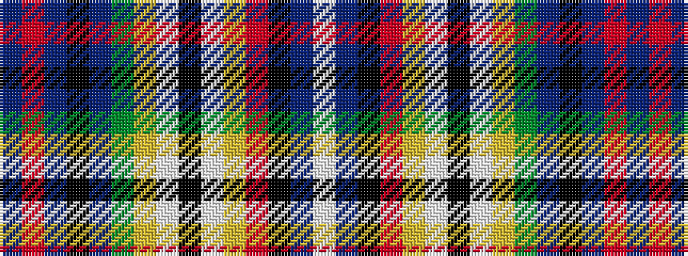

BRBKBGYWKWYRKBW

It is a 15 stripe tartan.

<figure class="pat-woven">

<figcaption>idealised sample</figcaption>
</figure>

## Colour Sequence



## Tartans with this colour sequence

| Tartans |
|---------------|
| [Unidentified #22](/variants/s15/db14r15dp4k18dp4dg20ly4w2k4w2ly4r8k6db1w6~x2/)|
||
| [Unidentified 4](/variants/s15/db14r15dp4k18dp4g20ly4w2k4w2ly4r8k6db1w6~x2/)|
||
