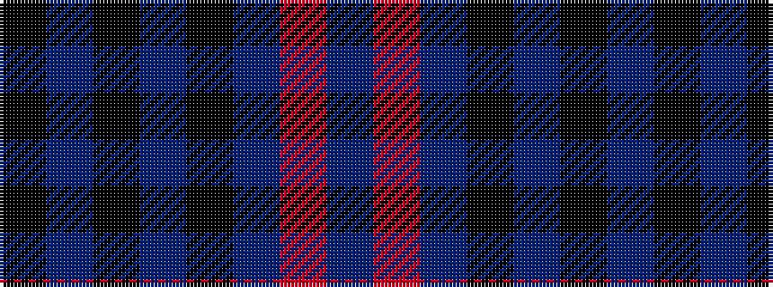

BRBKBKBK

It is a 8 stripe tartan.

<figure class="pat-woven">

<figcaption>idealised sample</figcaption>
</figure>

## Colour Sequence



## Tartans with this colour sequence

| Tartans |
|---------------|
| [Kelvingrove (Fashion)](/variants/s8/k16db1k1db1k1db9o18db1~x4/)|
||
