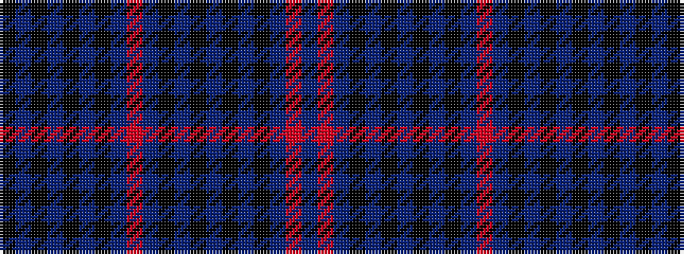

BRBKBKBKBKBRBKBKBKBK

It is a 20 stripe tartan.

<figure class="pat-woven">

<figcaption>idealised sample</figcaption>
</figure>

## Colour Sequence



## Tartans with this colour sequence

| Tartans |
|---------------|
| [Rangers F. C. Corporate Tartan Tartan Number: 2170. Earliest known date: 1994 The original tartan was designed in 1989 by Tartan Sportswear. Chris Aitken, designer for Geoffrey (Tailor) Highland Crafts, Edinburgh, increased the size of the sett and changed the shade of blue to suit the Rangers team colours. See products available Copyright © Blair Urquhart, Comrie, 2015](/setts/s20/db14r3db14k12db40k12db2k2db2k2db7r3db7k2db2k2db2k12db40k12~x2/)|
||
