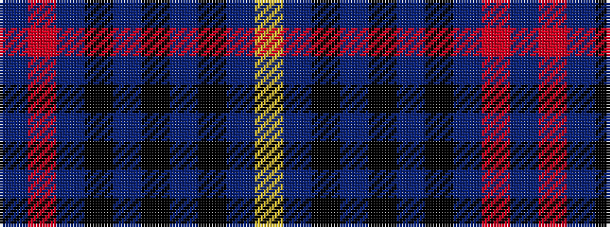

BRBKBKBKBY

It is a 10 stripe tartan.

<figure class="pat-woven">

<figcaption>idealised sample</figcaption>
</figure>

## Colour Sequence



## Tartans with this colour sequence

| Tartans |
|---------------|
| [Brady 60th, Keith James (Personal)](/setts/s10/n1o1n7k3n1k1n1k1db9lo1~x4/)|
||
