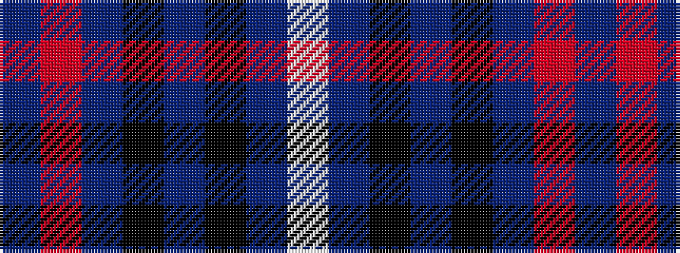

BRBKBKBW

It is a 8 stripe tartan.

<figure class="pat-woven">

<figcaption>idealised sample</figcaption>
</figure>

## Colour Sequence



## Tartans with this colour sequence

| Tartans |
|---------------|
| [Scotch Mist](/variants/s8/n4o4n4k4n18k3do38w3~x2/)|
||
