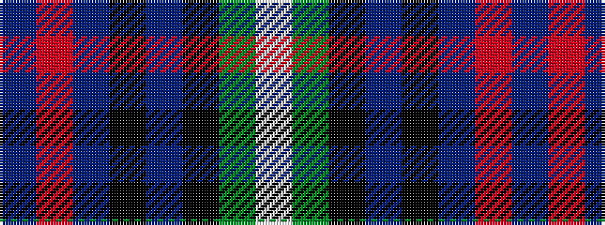

BRBKBKGW

It is a 8 stripe tartan.

<figure class="pat-woven">

<figcaption>idealised sample</figcaption>
</figure>

## Colour Sequence



## Tartans with this colour sequence

| Tartans |
|---------------|
| [Royal Highland](/variants/s8/lb4dg17k10dt3k3dt17r3dt3~x2/)|
||
