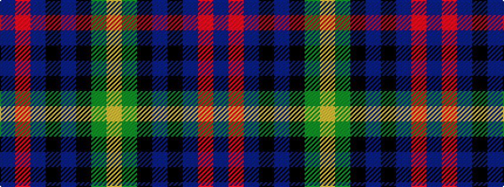

BRBKBKGY

It is a 8 stripe tartan.

<figure class="pat-woven">

<figcaption>idealised sample</figcaption>
</figure>

## Colour Sequence



## Tartans with this colour sequence

| Tartans |
|---------------|
| [Royal Highland Corporate Tartan](/variants/s8/lr8g33k21db6k6db33r6db6/)|
||
| [Royal Highland Society (Corporate)](/variants/s8/ly4dg17k10dt3k3dt17r3dt3~x2/)|
||
