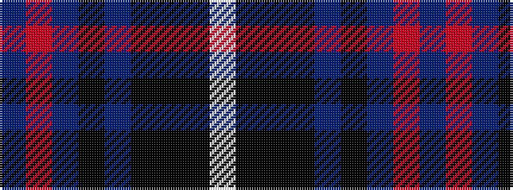

BRBKBKKKW

It is a 9 stripe tartan.

<figure class="pat-woven">

<figcaption>idealised sample</figcaption>
</figure>

## Colour Sequence



## Tartans with this colour sequence

| Tartans |
|---------------|
| [MacNeill](/variants/s9/db5r3db21ki5db5ki40k2ki2w1~x2/)|
||
