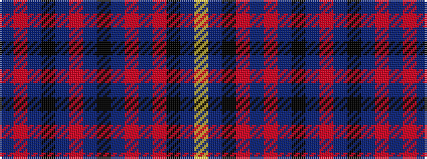

BRBKBRBKBRBRKBY

It is a 15 stripe tartan.

<figure class="pat-woven">

<figcaption>idealised sample</figcaption>
</figure>

## Colour Sequence



## Tartans with this colour sequence

| Tartans |
|---------------|
| [Cornwall](/setts/s15/n4r12n4k14n36r3n36k14n4r12n4r12k14n36lo3~x2/)|
||
