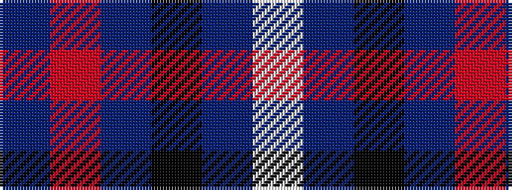

BRBKBW

It is a 6 stripe tartan.

<figure class="pat-woven">

<figcaption>idealised sample</figcaption>
</figure>

## Colour Sequence



## Tartans with this colour sequence

| Tartans |
|---------------|
| [Kintore (Fashion)](/setts/s6/dp2r1dp5k4db5lb1~x4/)|
||
| [Portrait, The](/setts/s6/do2o11do2k11do16lb2~x4/)|
||
