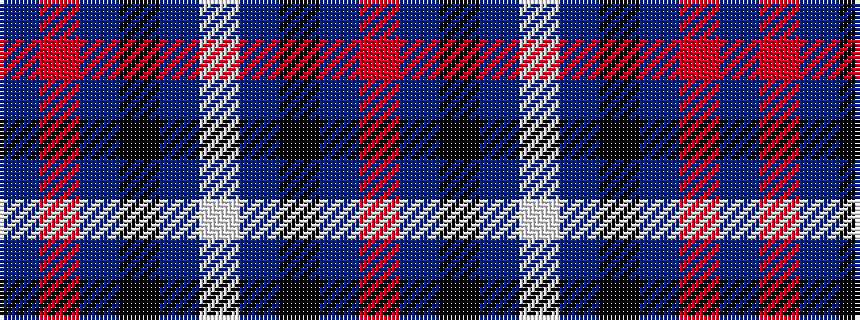

BRBKBWBKBR

It is a 10 stripe tartan.

<figure class="pat-woven">

<figcaption>idealised sample</figcaption>
</figure>

## Colour Sequence



## Tartans with this colour sequence

| Tartans |
|---------------|
| [Kintore](/setts/s10/dp2r1dp5k4db5lb1~x4/)|
||
