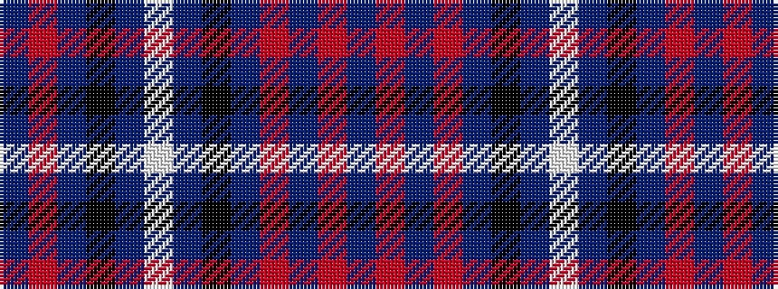

BRBKBWBKBRBRB

It is a 13 stripe tartan.

<figure class="pat-woven">

<figcaption>idealised sample</figcaption>
</figure>

## Colour Sequence



## Tartans with this colour sequence

| Tartans |
|---------------|
| [Westwood MacPoiret (Fashion)](/setts/s13/db21o3db3o3db3k20dp18w3dp18k20db18o3db3~x2/)|
||
