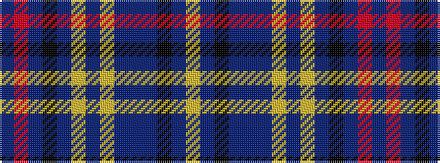

BRBKBYBYBBBKBY

It is a 14 stripe tartan.

<figure class="pat-woven">

<figcaption>idealised sample</figcaption>
</figure>

## Colour Sequence



## Tartans with this colour sequence

| Tartans |
|---------------|
| [Black Rose](/setts/s14/lr20dp3k8dp3db2dp24lr2dp3lr2dp24k15dp1o3dp2~x2/)|
||
