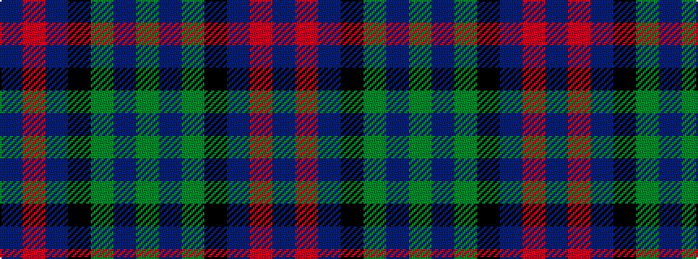

BRBKGBG

It is a 7 stripe tartan.

<figure class="pat-woven">

<figcaption>idealised sample</figcaption>
</figure>

## Colour Sequence



## Tartans with this colour sequence

| Tartans |
|---------------|
| [MacTaggart](/variants/s7/dg30db4dg2k20db18r1db4~x2/)|
||
| [MacTaggert](/variants/s7/g9t2g1k6db6r1db1~x2/)|
||
| [MacTaggert](/variants/s7/g30db4g2k20db18r1db4~x2/)|
||
