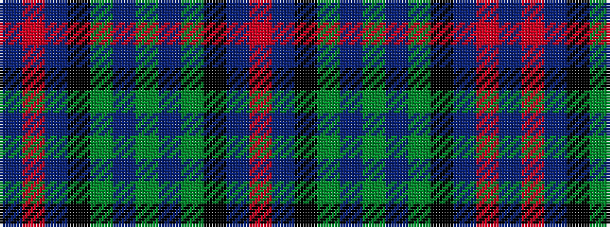

BRBKGBGBGKBR

It is a 12 stripe tartan.

<figure class="pat-woven">

<figcaption>idealised sample</figcaption>
</figure>

## Colour Sequence



## Tartans with this colour sequence

| Tartans |
|---------------|
| [MacTaggart (Johnstons)](/setts/s12/db1r1db6k6g1b2g9b2g1k6db6r1~x8/)|
||
