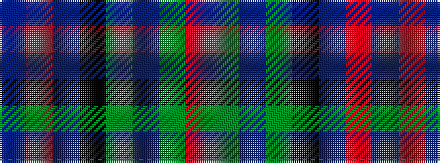

BRBKGBGR

It is a 8 stripe tartan.

<figure class="pat-woven">

<figcaption>idealised sample</figcaption>
</figure>

## Colour Sequence



## Tartans with this colour sequence

| Tartans |
|---------------|
| [Burnfoot Check](/variants/s8/r3dg2n2dg3k6db2o10db2~x2/)|
||
