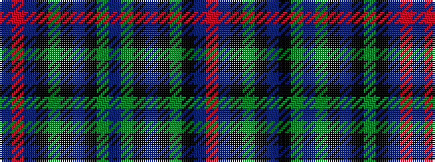

BRBKGKBKGBGKBKGKBR

It is a 18 stripe tartan.

<figure class="pat-woven">

<figcaption>idealised sample</figcaption>
</figure>

## Colour Sequence



## Tartans with this colour sequence

| Tartans |
|---------------|
| [South Australia](/variants/s18/b13g19k2b7k2g7k2db18r2b13~x2/)|
||
