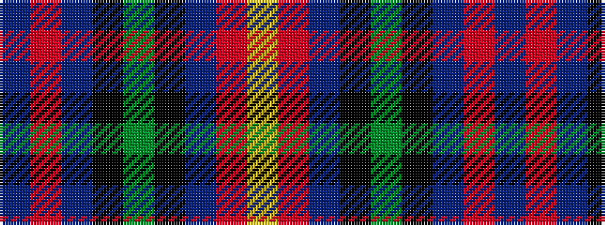

BRBKGKBRY

It is a 9 stripe tartan.

<figure class="pat-woven">

<figcaption>idealised sample</figcaption>
</figure>

## Colour Sequence



## Tartans with this colour sequence

| Tartans |
|---------------|
| [MacAllum of Berwick (Clan?)](/variants/s9/db10r7db31k25dg23k8db7r8ly5~x2/)|
||
