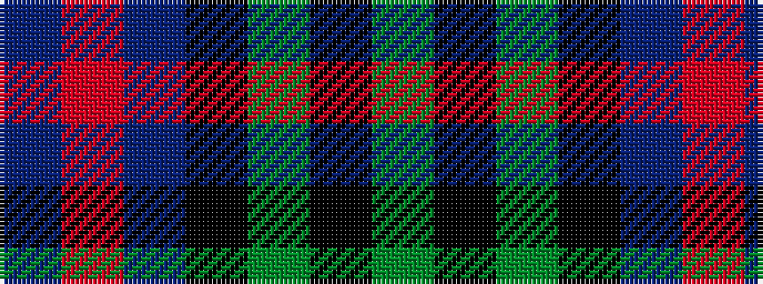

BRBKGKG

It is a 7 stripe tartan.

<figure class="pat-woven">

<figcaption>idealised sample</figcaption>
</figure>

## Colour Sequence



## Tartans with this colour sequence

| Tartans |
|---------------|
| [Unidentified Pinafore](/setts/s7/dg24k4dg24k24t7r24t7~x2/)|
||
| [Unidentified, Pinafore](/setts/s7/g24k4g24k24t7r24t7~x2/)|
||
