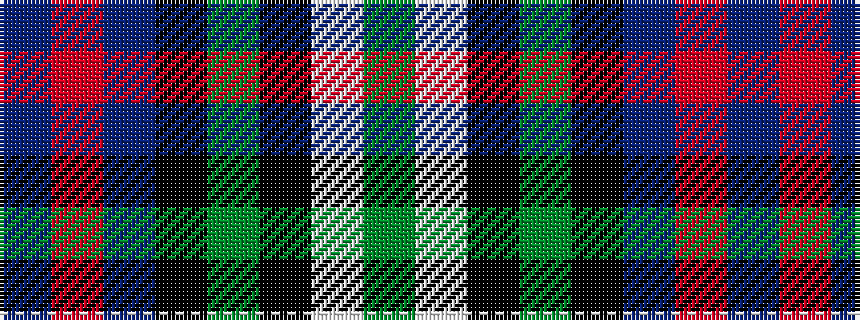

BRBKGKWG

It is a 8 stripe tartan.

<figure class="pat-woven">

<figcaption>idealised sample</figcaption>
</figure>

## Colour Sequence



## Tartans with this colour sequence

| Tartans |
|---------------|
| [Davidson Double](/setts/s8/dg3lb2k3dg8k8db8r2db3/)|
||
