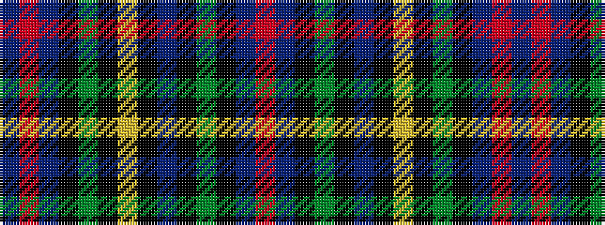

BRBKGKYKBKGKBR

It is a 14 stripe tartan.

<figure class="pat-woven">

<figcaption>idealised sample</figcaption>
</figure>

## Colour Sequence



## Tartans with this colour sequence

| Tartans |
|---------------|
| [Malcolm (a)](/setts/s14/db1r1db6k6dg6k1ly1k1b1k1dg6k6db6r1~x2/)|
||
