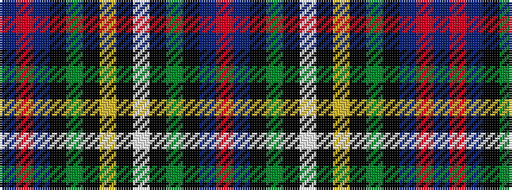

BRBKGKYKWKGKBR

It is a 14 stripe tartan.

<figure class="pat-woven">

<figcaption>idealised sample</figcaption>
</figure>

## Colour Sequence



## Tartans with this colour sequence

| Tartans |
|---------------|
| [Malcolm](/variants/s14/db1r1db6k6dg6k1ly1k1lb1k1dg6k6db6r1/)|
||
