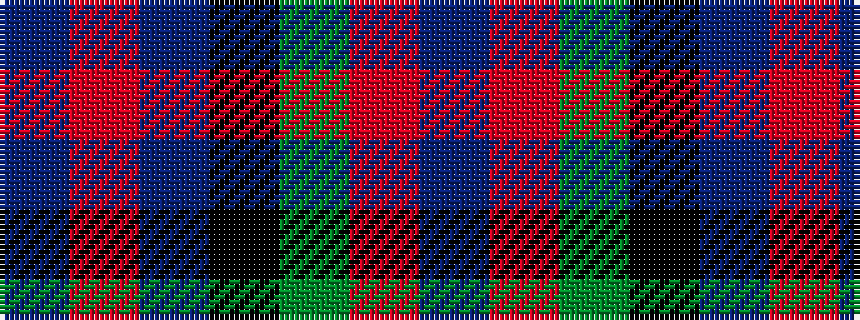

BRBKGRB

It is a 7 stripe tartan.

<figure class="pat-woven">

<figcaption>idealised sample</figcaption>
</figure>

## Colour Sequence



## Tartans with this colour sequence

| Tartans |
|---------------|
| [MacNaughton (Logan)](/setts/s7/db5r17dg16k10db10r17db5~x2/)|
||
