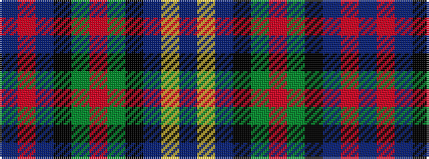

BRBKGRGKBYB

It is a 11 stripe tartan.

<figure class="pat-woven">

<figcaption>idealised sample</figcaption>
</figure>

## Colour Sequence



## Tartans with this colour sequence

| Tartans |
|---------------|
| [Boxell of West Niddry, Baron (Personal)](/setts/s11/dp27ly2dp2k12g6m2g12k12db12r2db2~x2/)|
||
