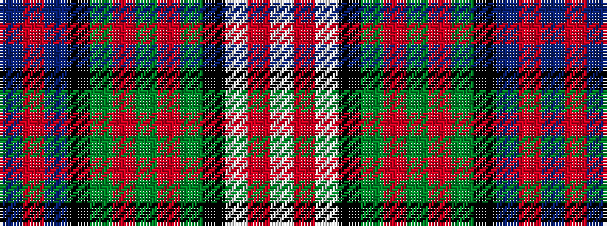

BRBKGRGRGKWRW

It is a 13 stripe tartan.

<figure class="pat-woven">

<figcaption>idealised sample</figcaption>
</figure>

## Colour Sequence



## Tartans with this colour sequence

| Tartans |
|---------------|
| [Blair Dress](/variants/s13/db2r2db12k5dg12r2dg2r2dg12k5w14r2w2~x2/)|
||
| [Blair, dress](/variants/s13/db1r1db8k3g8r1g1r1g8k3w10r1w1~x4/)|
||
