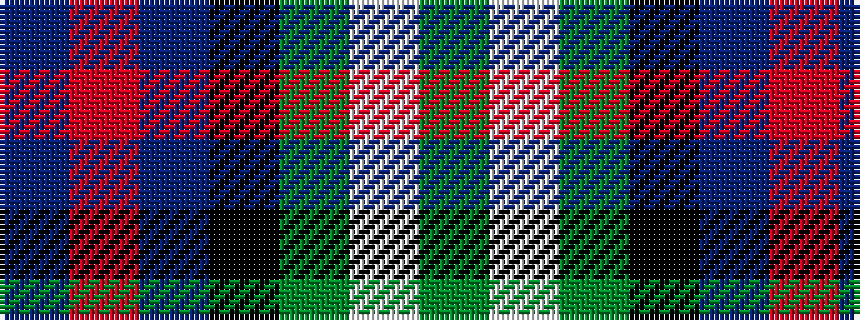

BRBKGWG

It is a 7 stripe tartan.

<figure class="pat-woven">

<figcaption>idealised sample</figcaption>
</figure>

## Colour Sequence



## Tartans with this colour sequence

| Tartans |
|---------------|
| [MacLean, Donald (Personal)](/setts/s7/g16lb3g3k10db12r2db3~x2/)|
||
| [MacThomas](/setts/s7/db3r2db22k11g24lp2g3~x2/)|
||
| [MacThomas (Clan)](/setts/s7/dg5lp3dg32k16b32m3b5~x2/)|
||
| [MacThomas Clan Tartan Tartan Number: 407. Earliest known date: 1975 Designed by David Thomas - former director of the Strathmore Woollen Co. in Forfar who still (in 2011) weave this tartan. Adopted by Clan Society in 1975, and registered with Lord Lyon in 1979. See products available Copyright © Blair Urquhart, Comrie, 2015](/setts/s7/db3m2db22k11g24lp2g3~x2/)|
||
| [Sinclair Dress (Dance)](/setts/s7/db4r2db31k10g4w21g2~x2/)|
||
| [Sinclair dress](/setts/s7/db2r1db16k5g2w11g1~x4/)|
||
