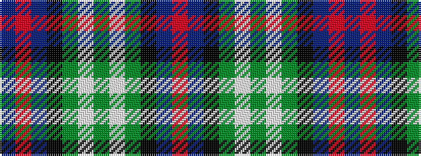

BRBKGWGWGKBR

It is a 12 stripe tartan.

<figure class="pat-woven">

<figcaption>idealised sample</figcaption>
</figure>

## Colour Sequence



## Tartans with this colour sequence

| Tartans |
|---------------|
| [Sinclair Dress (Dance)](/setts/s12/db4r2db31k10g4w21g2~x2/)|
||
