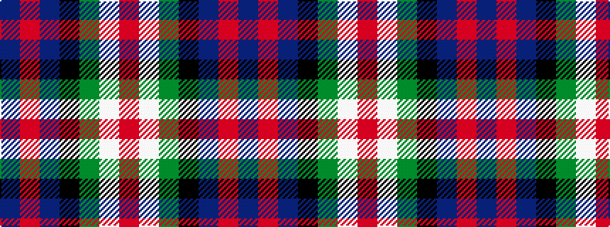

BRBKGWR

It is a 7 stripe tartan.

<figure class="pat-woven">

<figcaption>idealised sample</figcaption>
</figure>

## Colour Sequence



## Tartans with this colour sequence

| Tartans |
|---------------|
| [Jack Sinclair (Personal)](/variants/s7/b4r2b40k11g2w16r2~x2/)|
||
| [Sinclair, Blue (Personal)](/variants/s7/db4r2db40k11g2w16r2~x2/)|
||
| [Sinclair, The Jack](/variants/s7/db4r2db39k11g2w16r2~x2/)|
||
