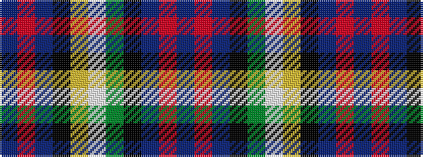

BRBKGWYKBRB

It is a 11 stripe tartan.

<figure class="pat-woven">

<figcaption>idealised sample</figcaption>
</figure>

## Colour Sequence



## Tartans with this colour sequence

| Tartans |
|---------------|
| [Sandhu (Name)](/setts/s11/n12r4n64k64g7w7lo7k64n64r4n12/)|
||
