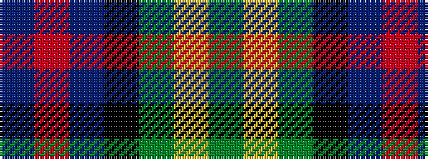

BRBKGYG

It is a 7 stripe tartan.

<figure class="pat-woven">

<figcaption>idealised sample</figcaption>
</figure>

## Colour Sequence



## Tartans with this colour sequence

| Tartans |
|---------------|
| [McComb](/setts/s7/db3r2db18k6dg18ly2g3~x2/)|
||
| [McComb (Personal)](/setts/s7/db3r2db18k6gi18ly2g3~x2/)|
||
