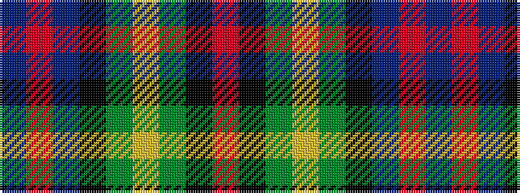

BRBKGYGKR

It is a 9 stripe tartan.

<figure class="pat-woven">

<figcaption>idealised sample</figcaption>
</figure>

## Colour Sequence



## Tartans with this colour sequence

| Tartans |
|---------------|
| [Buckie](/variants/s9/o4k2dg2ly1dg8k20db50r2db2~x2/)|
||
