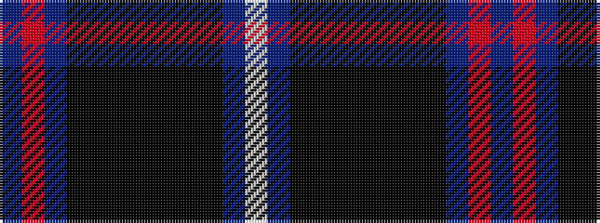

BRBKKKKKKKBW

It is a 12 stripe tartan.

<figure class="pat-woven">

<figcaption>idealised sample</figcaption>
</figure>

## Colour Sequence



## Tartans with this colour sequence

| Tartans |
|---------------|
| [McWilliams Dress (2014)](/variants/s12/db3r2db13k9ki3k2ki14k2ki3k9db15w3~x2/)|
||
