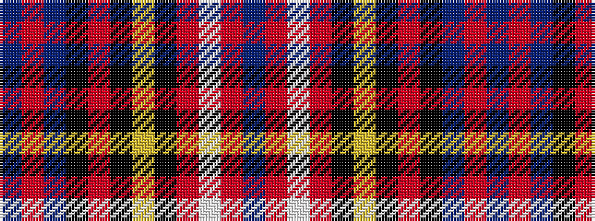

BRBKRKYKRWRB

It is a 12 stripe tartan.

<figure class="pat-woven">

<figcaption>idealised sample</figcaption>
</figure>

## Colour Sequence



## Tartans with this colour sequence

| Tartans |
|---------------|
| [City of Barrie](/variants/s12/b50r3b4k8o4k2ly3k2r12w2r4b4~x2/)|
||
