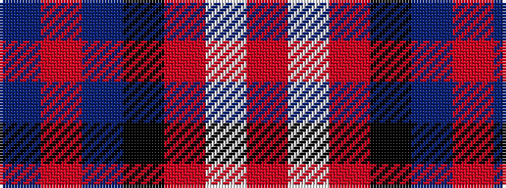

BRBKRWR

It is a 7 stripe tartan.

<figure class="pat-woven">

<figcaption>idealised sample</figcaption>
</figure>

## Colour Sequence



## Tartans with this colour sequence

| Tartans |
|---------------|
| [Americana - 1978 #2 (Fashion)](/setts/s7/db2r2db28k11r27w2r2~x2/)|
||
