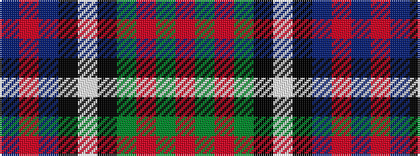

BRBKWKGRGR

It is a 10 stripe tartan.

<figure class="pat-woven">

<figcaption>idealised sample</figcaption>
</figure>

## Colour Sequence



## Tartans with this colour sequence

| Tartans |
|---------------|
| [Law Society of Scotland](/variants/s10/t5r3t30k6w4k6g24r4g6r3/)|
||
