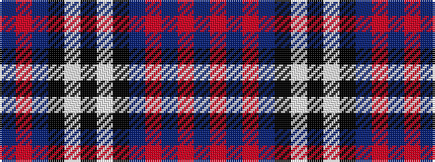

BRBKWKWKBRBRB

It is a 13 stripe tartan.

<figure class="pat-woven">

<figcaption>idealised sample</figcaption>
</figure>

## Colour Sequence



## Tartans with this colour sequence

| Tartans |
|---------------|
| [Commonwealth Variation (Fashion)](/variants/s13/db20r3db3r3db3k10w14k4w14k10db14r3db3~x2/)|
||
