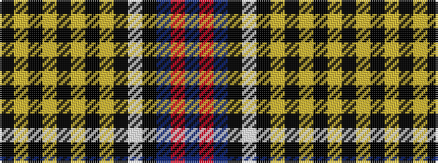

BRBKWKYKYKYKYK

It is a 14 stripe tartan.

<figure class="pat-woven">

<figcaption>idealised sample</figcaption>
</figure>

## Colour Sequence



## Tartans with this colour sequence

| Tartans |
|---------------|
| [Goldwire (2015)](/setts/s14/k3lo3k3lo3k3lo3k3lo3k36w1k2dt9r2dt1~x2/)|
||
