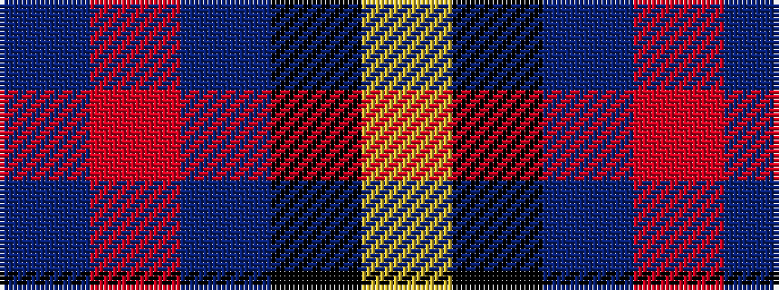

BRBKY

It is a 5 stripe tartan.

<figure class="pat-woven">

<figcaption>idealised sample</figcaption>
</figure>

## Colour Sequence



## Tartans with this colour sequence

| Tartans |
|---------------|
| [MacLaine of Lochbuie Hunting](/setts/s5/dt32r3dt4k2lo3~x2/)|
||
| [MacLaine of Lochbuie Hunting](/setts/s5/db32r3db4k1ly3/)|
||
| [MacLaine of Lochbuie, hunting](/setts/s5/db32r3db4k1ly3~x2/)|
||
