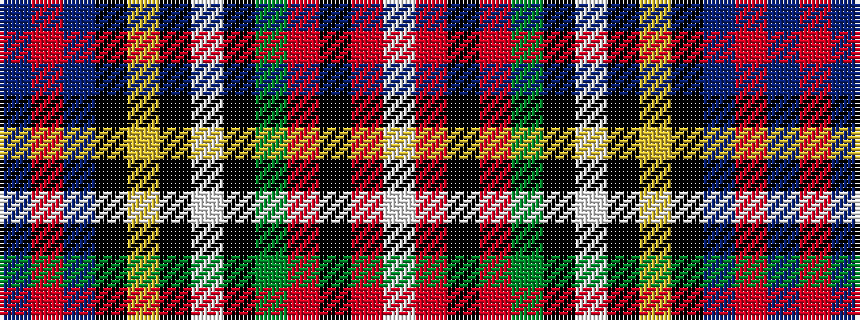

BRBKYKWKGRKRW

It is a 13 stripe tartan.

<figure class="pat-woven">

<figcaption>idealised sample</figcaption>
</figure>

## Colour Sequence



## Tartans with this colour sequence

| Tartans |
|---------------|
| [Prince Albert](/variants/s13/db23r6db6k10ly3k2w2k2g11r12k2r10w2~x2/)|
||
| [Prince Albert](/variants/s13/db23r6db6k10ly3k2w2k2dg11r12k2r10w2~x2/)|
||
