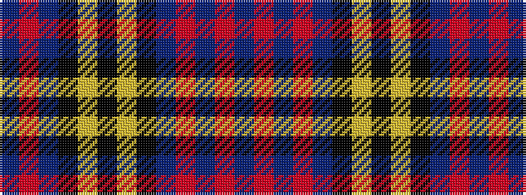

BRBKYKYKBRBRB

It is a 13 stripe tartan.

<figure class="pat-woven">

<figcaption>idealised sample</figcaption>
</figure>

## Colour Sequence



## Tartans with this colour sequence

| Tartans |
|---------------|
| [Commonwealth Variation](/setts/s13/db20r3db3r3db3k10lr14k4lr14k10db14r3db3~x2/)|
||
