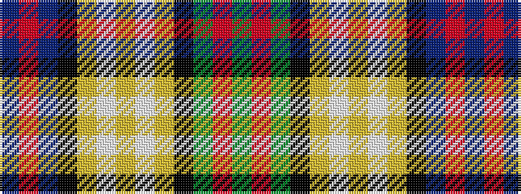

BRBKYWYWYKGRG

It is a 13 stripe tartan.

<figure class="pat-woven">

<figcaption>idealised sample</figcaption>
</figure>

## Colour Sequence



## Tartans with this colour sequence

| Tartans |
|---------------|
| [Redgate (Name)](/variants/s13/t10r3t10k7lo5w2lo5w2lo5k7g10r3g7~x2/)|
||
