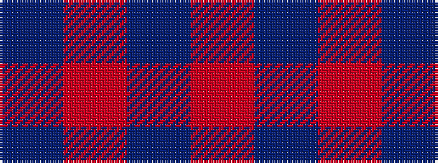

BRBR

It is a 4 stripe tartan.

<figure class="pat-woven">

<figcaption>idealised sample</figcaption>
</figure>

## Colour Sequence



## Tartans with this colour sequence

| Tartans |
|---------------|
| [Elliot](/setts/s4/db16m4db3r1~x2/)|
||
| [Elliott](/setts/s4/db16r4db3r1~x2/)|
||
| [Haggis Hostels](/setts/s4/r10t5o5n4~x8/)|
||
| [Masai Shuka 21 (Artefact)](/setts/s4/r40db2r6db15~x2/)|
||
